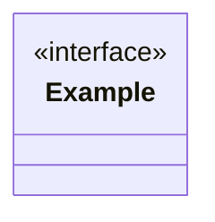

# Class / Object Responsibility Design: [FEATURE]

**Trigger**: [Why multiple cooperating design objects or dependency direction requires this artifact.]

| Object / Interface | Kind | Responsibility | Collaborators | Relationship / Direction | Planned U |
|---|---|---|---|---|---|
| [Name] | [service/repository/adapter/controller/view-model/etc.] | [Non-overlapping responsibility] | [Names] | [implements/composes/depends/references] | [U ref] |

## Diagram

Do not copy complete domain fields, boundary payload schemas, test matrices,
task IDs, private helpers, or method bodies.
